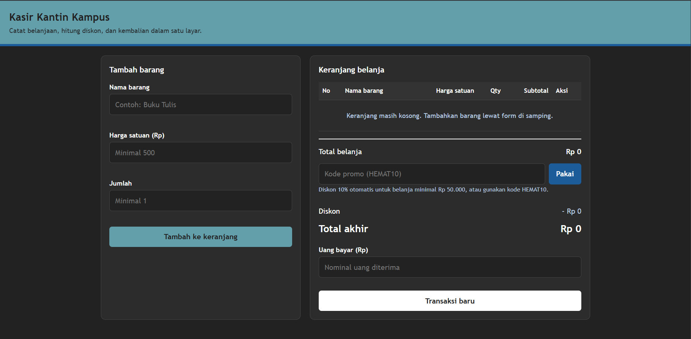
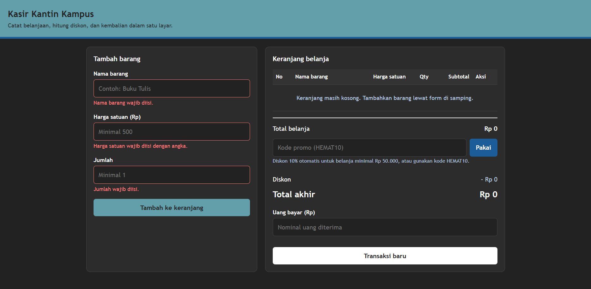
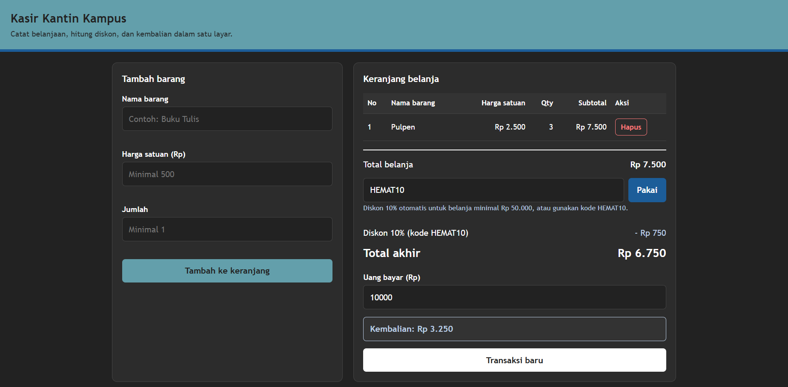
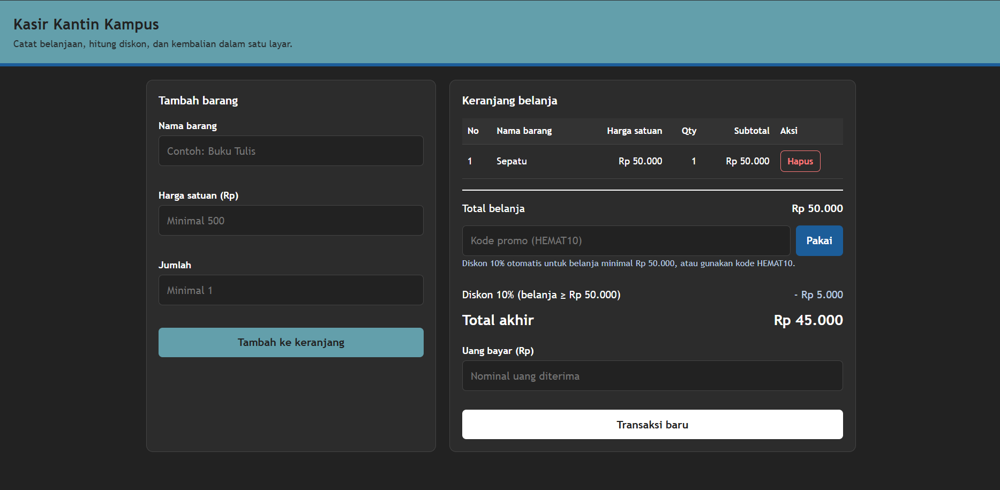

# Kasir Kantin Kampus (Mini POS)

Aplikasi web kasir sederhana untuk kantin atau toko kampus, dibuat dengan HTML, CSS, dan JavaScript murni (tanpa framework atau library).

## Identitas

| Keterangan | Isian |
| --- | --- |
| Nama Lengkap | Khairul Rijal Syauqi |
| NIM | 123140143 |
| Kelas Praktikum | RB |

## Deskripsi Aplikasi

**Kasir Kantin Kampus** adalah aplikasi Mini POS (Point of Sale) yang membantu kasir mencatat barang belanjaan, menghitung total, diskon, dan kembalian secara otomatis.

**Tujuan pembuatan:** menyatukan tiga kompetensi dasar praktikum dalam satu studi kasus, yaitu:

1. validasi input form,
2. perhitungan kalkulator otomatis, dan
3. manajemen keranjang belanja berbasis `localStorage`.

**Studi kasus:** kasir kantin/toko kampus. Kasir memasukkan nama barang, harga satuan, dan jumlah. Aplikasi menghitung subtotal, total belanja, diskon, total akhir, serta kembalian dari uang yang dibayarkan pembeli. Isi keranjang tetap tersimpan walaupun halaman di-refresh.

## Panduan Menjalankan

### Struktur folder

```
mini-pos/
├── index.html
├── style.css
├── script.js
├── README.md
└── screenshots/       
```

### Opsi 1: Live Server di VS Code (disarankan)

1. Buka folder `mini-pos` di **Visual Studio Code**.
2. Pasang ekstensi **Live Server** (pembuat: Ritwick Dey) dari menu Extensions.
3. Klik kanan pada `index.html`, lalu pilih **Open with Live Server**.
4. Browser akan terbuka otomatis, biasanya di `http://127.0.0.1:5500`.

### Opsi 2: Buka langsung

Klik dua kali `index.html` agar terbuka di browser (Chrome, Edge, atau Firefox). Pastikan `style.css` dan `script.js` berada di folder yang sama.

## Daftar Fitur

**Validasi form input barang**
- [x] Nama barang wajib diisi, minimal 3 karakter
- [x] Harga satuan wajib angka positif, minimal Rp 500
- [x] Jumlah (qty) wajib angka bulat, minimal 1
- [x] Pesan error berwarna merah muncul di bawah input yang salah
- [x] Barang tidak masuk keranjang selama ada input yang tidak valid
- [x] Form otomatis di-reset setelah barang berhasil ditambahkan

**Kalkulator dan perhitungan otomatis**
- [x] Subtotal per barang (harga satuan × qty)
- [x] Total belanja dari seluruh subtotal
- [x] Diskon 10% otomatis untuk total belanja minimal Rp 50.000
- [x] Kode promo `HEMAT10` untuk diskon 10%
- [x] Tampilan nominal diskon dan total akhir
- [x] Input uang bayar dengan kembalian otomatis (uang bayar − total akhir)
- [x] Keterangan "uang belum mencukupi" beserta kekurangannya

**Keranjang dan localStorage**
- [x] Tabel keranjang (No, Nama Barang, Harga Satuan, Qty, Subtotal, Aksi)
- [x] Tombol **Hapus** per barang, total dan diskon dihitung ulang otomatis
- [x] Keranjang disimpan dengan `JSON.stringify()` dan dimuat ulang dengan `JSON.parse()`
- [x] Isi keranjang tidak hilang saat halaman di-refresh
- [x] Tombol **Transaksi baru** untuk mengosongkan keranjang dan membersihkan `localStorage`

## Tangkapan Layar


### 1. Tampilan form input utama



_Keterangan: Tampilan awal aplikasi saat pertama kali dibuka. Di sisi kiri ada form Tambah barang dengan tiga isian: nama barang, harga satuan, dan jumlah, lengkap dengan petunjuk batas minimal pada tiap kolom. Di sisi kanan, tabel keranjang masih kosong dan total belanja, diskon, serta total akhir bernilai Rp 0._

### 2. Tampilan saat validasi error muncul



_Keterangan: Tombol Tambah ke keranjang ditekan saat semua kolom masih kosong. Aplikasi menampilkan pesan error berwarna merah di bawah setiap input yang salah ("Nama barang wajib diisi.", "Harga satuan wajib diisi dengan angka.", dan "Jumlah wajib diisi."), dan garis tepi kolomnya ikut berubah merah. Barang tidak masuk ke keranjang, terlihat dari tabel di kanan yang tetap kosong._

### 3. Tampilan hasil perhitungan dan tabel keranjang



_Keterangan: Contoh transaksi kecil: Pulpen seharga Rp 2.500 dengan jumlah 3, sehingga subtotal Rp 7.500. Karena total belanja belum mencapai Rp 50.000, diskon diberikan lewat kode promo HEMAT10 sebesar 10% (Rp 750), sehingga total akhir menjadi Rp 6.750. Saat uang bayar diisi Rp 10.000, kembalian langsung dihitung otomatis, yaitu Rp 3.250._

### 4. Tampilan diskon otomatis untuk belanja Rp 50.000



_Keterangan: Contoh belanja Sepatu seharga Rp 50.000 dengan jumlah 1, sehingga total belanja tepat Rp 50.000. Karena sudah mencapai batas minimal, aplikasi langsung memberi diskon 10% secara otomatis tanpa kode promo, sebesar Rp 5.000. Keterangannya tampil sebagai "Diskon 10% (belanja ≥ Rp 50.000)", dan total akhir yang harus dibayar menjadi Rp 45.000._

## Penjelasan Teknis Singkat

Seluruh logika ada di `script.js`. Alur utamanya sebagai berikut.

### 1. Penanganan validasi input

Saat tombol **Tambah ke keranjang** ditekan, event `submit` form dicegah dengan `preventDefault()`, lalu fungsi `validasi()` dijalankan. Fungsi ini membaca ketiga input dan memeriksanya satu per satu:

- **Nama:** hasil `trim()` tidak boleh kosong dan panjangnya minimal 3 karakter.
- **Harga:** dikonversi dengan `Number()`, harus berupa angka yang valid, lebih dari 0, dan minimal 500.
- **Qty:** harus angka yang valid, bulat (`Number.isInteger`), dan minimal 1.

Setiap input memiliki pesan error sendiri yang ditampilkan lewat fungsi `setError()` (teks merah di bawah input, plus garis tepi merah). Semua input diperiksa sekaligus, sehingga semua kesalahan tampil bersamaan. Jika ada satu saja yang salah, `validasi()` mengembalikan `null` dan barang tidak dimasukkan ke keranjang. Jika semua benar, barang ditambahkan ke array `keranjang`, data disimpan, form di-`reset()`, dan tabel digambar ulang.

### 2. Algoritma kalkulator

Fungsi `hitung()` dipanggil setiap kali tampilan diperbarui, dengan langkah:

1. **Total belanja** = jumlah dari `harga × qty` semua barang, dihitung dengan `reduce()`.
2. **Diskon** = 10% dari total jika total ≥ Rp 50.000 **atau** kode `HEMAT10` aktif. Keduanya tidak ditumpuk, jadi diskon maksimal tetap 10%.
3. **Total akhir** = total belanja − diskon.
4. **Kembalian** (di `renderBayar()`) = uang bayar − total akhir. Jika uang bayar lebih kecil dari total akhir, ditampilkan keterangan bahwa uang belum mencukupi beserta jumlah kekurangannya.

Karena semua angka dihitung dari isi array `keranjang`, menghapus barang otomatis memperbarui total, diskon, dan kembalian.

### 3. Mekanisme localStorage

Data disimpan dengan kunci `miniPosKeranjang` dalam bentuk objek:

```js
{ items: [ { nama, harga, qty }, ... ], promo: true/false }
```

- **Simpan:** `simpan()` memanggil `localStorage.setItem(KEY, JSON.stringify(...))` setiap kali keranjang atau status promo berubah (tambah, hapus, atau pakai promo).
- **Muat:** saat halaman dibuka, `muat()` membaca `localStorage.getItem(KEY)`, mengubahnya dengan `JSON.parse()`, lalu menyaring data yang tidak valid sebelum dipakai. Blok `try/catch` mencegah aplikasi error jika data rusak.
- **Reset:** tombol **Transaksi baru** mengosongkan array, memanggil `localStorage.removeItem(KEY)`, lalu menggambar ulang tampilan.
